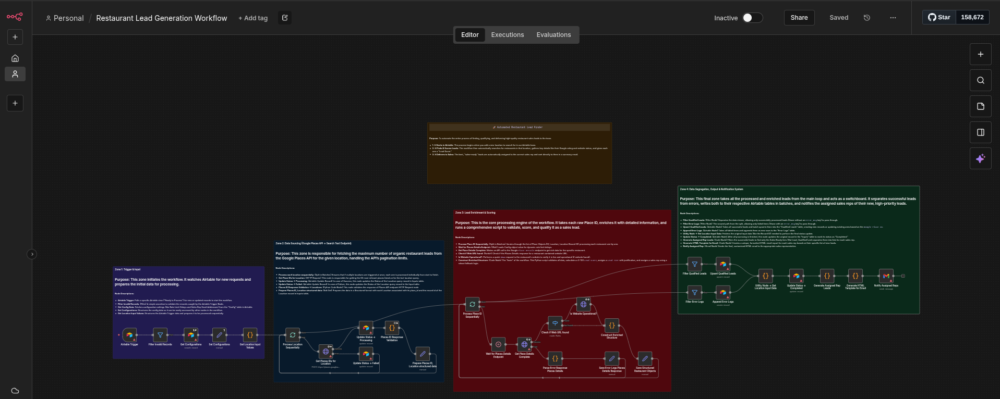
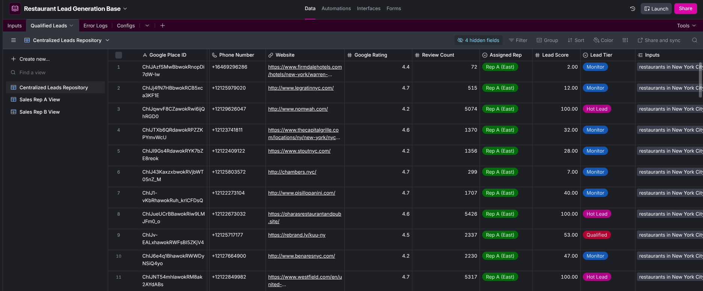

# 🍽️ Automated Restaurant Lead Generation Engine

> **Automated B2B Lead Sourcing, Enrichment, and Qualification System**

## 📋 Executive Summary
This project replaces manual lead generation with an automated AI pipeline. It inputs a location (e.g., "Austin, TX"), scrapes Google Places for restaurants, enriches the data (Live Website Check + Meta Data), calculates a generic "Lead Score," and assigns high-quality leads to sales representatives based on territory.

**Key Tech Stack:** n8n, Python (Data Processing), Airtable (Backend/Frontend), Google Places API.

## 🚀 Key Features
- **Smart Enrichment:** Validates website uptime and business status before qualification.
- **Scoring Algorithm:** Custom Python logic scores leads (0-100) based on review count, rating, and data density.
- **Territory Routing:** Automatically assigns leads to "East" vs "West" sales reps based on State/Longitude.
- **Self-Healing:** Includes a Global Error Handler that catches API failures and logs them to a dedicated Airtable view.

---

## ⚙️ How to Run This Project (Plug & Play)

### Prerequisites
- An [n8n](https://n8n.io/) instance (Cloud or Self-Hosted).
- A Google Cloud Project with **Places API (New)** enabled.
- An Airtable Account.

### Step 1: Clone the Database
We use Airtable as the configuration and data backend. Click the image below to access the template, then click **"Copy Base"** in the top-right corner to save it to your workspace.

> **Note:** Once cloned, remember to update the `Configs` table with your own email address (`rep_a_email`) to receive the test alerts.
### Step 2: Import Workflows
1.  Download the `main_lead_gen.json` from the `/workflows` folder in this repo.
2.  In n8n, create a new workflow and select **Import from File**.
3.  Repeat for `global_error_handler.json`.

### Step 3: Configure Credentials
In your n8n instance, set up the following credentials:
- **Google Places API:** API Key from GCP.
- **Airtable Token:** Generate a Personal Access Token with "Editor" permissions for your new base.
- **Gmail/Email:** SMTP or Gmail OAuth to send the alerts.

---

## 📂 Repository Structure
- `/workflows` - JSON exports of the logic. Import these directly into n8n.
- `/documentation` - Full technical breakdown and decision logs.
- `/assets` - Airtable Schema and n8n Workflow overview.

## 🛠️ Architecture
**Data Flow:**
`Airtable Trigger` -> `Google Places API` -> `Python Enrichment` -> `Scoring Logic` -> `Airtable Upsert` -> `Email Notification`

---

### 👤 Author
**Shahrose Khaliq**
Software Engineer | Automation Specialist
[LinkedIn Profile](<https://www.linkedin.com/in/shahrose-k>)
[Fiverr Profile](<https://www.fiverr.com/s/gD62BlY>)
