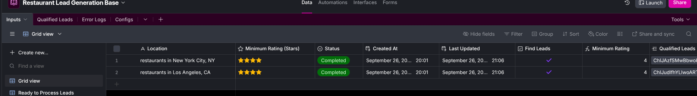
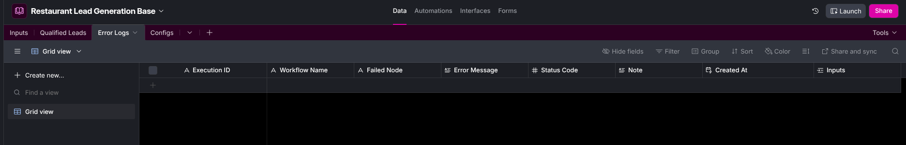
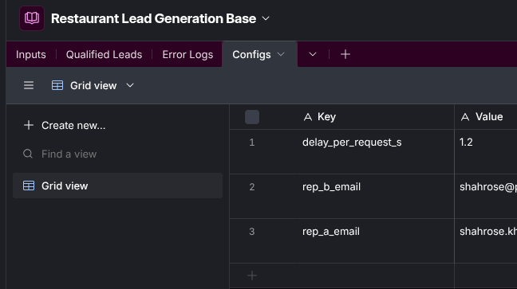

# Automated Restaurant Lead Generation Service
### A Comprehensive Research and Development Report

---

## 1. Executive Summary
This document details the research and development process for a Proof of Concept (POC) lead generation service. The primary objective was to build an automated system that retrieves restaurant data for a given location, enriches it, qualifies it, and assigns it to the appropriate sales representative for outreach.

The final solution leverages the **n8n** automation platform, with **Airtable** serving as a user-friendly control panel and data backend. The initial strategy of using third-party B2B enrichment APIs was pivoted due to reliance on paid subscriptions and restrictive business email verification requirements. Instead, the project's focus shifted to creating a best-in-class data sourcing and qualification engine.

### Key Achievements
* **High-Quality Data Sourcing:** Successfully integrated the Google Places API to ensure a reliable stream of accurate, real-time restaurant data.
* **Intelligent Lead Qualification:** Developed a sophisticated data processing engine in Python that validates, scores, and assigns leads using a multi-tier qualification system and resilient geographic assignment logic.
* **Robust & Scalable Architecture:** Implemented a transactional workflow in n8n with comprehensive state management and centralized error logging, ensuring reliability and preparing the system for future high-volume processing.
* **Automated Lead Delivery:** Created a seamless lead delivery system that stores all leads in a central Airtable base, provides personalized views for each sales representative, and sends automated HTML email notifications for high-priority leads.

The resulting POC is a powerful and stable foundation, perfectly primed for the future integration of a dedicated B2B enrichment tool to append decision-maker contact details.

---

## 2. Initial Strategy & Scoping
The initial strategy was a dual-path approach designed for speed and efficiency:

1.  **Primary Path (B2B Enrichment):** The fastest route to obtaining decision-maker data was to leverage a third-party B2B data provider. Extensive research was conducted to identify tools with generous free tiers, such as Apollo.io and Hunter.io.
2.  **Secondary Path (Web Scraping & AI):** As a scalable alternative, a plan was formulated to use web scraping strategies to gather website content and a low-cost Large Language Model (LLM) to extract contact details.

---

## 3. Core Infrastructure R&D
A significant challenge emerged during the tool selection phase: accessing the trial tiers of leading B2B enrichment tools required a verified business email address or paid API access.

The following R&D steps were taken to address this:
* **Infrastructure Setup:** A .xyz domain was purchased and linked to a business email hosting service to bypass verification restrictions.
* **Tool Evaluation:** A comprehensive evaluation revealed that industry-leading platforms restricted API access to paid subscriptions, while accessible free-tier alternatives failed to meet data quality benchmarks.
* **Alternative Assessment (Apify):** Pre-built scrapers on Apify were explored but ruled out due to strict paywalls and lack of trial periods.
* **Strategic Pivot:** Consequently, reliance on third-party enrichment tools was abandoned. The project scope was adjusted to de-scope decision-maker enrichment and instead focus on engineering a proprietary, high-quality data sourcing and qualification engine.

---

## 4. Data Sourcing Strategy
With the focus shifted from *who* (decision-makers) to *what* (highest quality leads), the sourcing strategy was re-evaluated.

* **Initial Approach (Overpass API):** The first iteration utilized the OpenStreetMap Overpass API. While free, the data proved unreliable—frequently outdated or missing critical fields like website and operational status.
* **Strategic Trade-Off (Google Places API):** A decisive pivot was made to the Google Places API. Although a premium service, the $300 monthly free credit offered by GCP was sufficient for the POC. This provided consistently accurate, real-time data including verified business status, ratings, and review counts—metrics essential for the scoring engine.

---

## 5. Workflow Architecture & Design
The core service is built in **n8n**, focusing on transactional resilience.

* **Airtable-Driven Control:** The workflow is initiated entirely from an Airtable base. Variables (like sales rep emails) are stored in Airtable, allowing updates without code changes.
* **Transactional Processing:** The workflow uses a `SplitInBatches` node (size 1) to process each location request individually, ensuring stability and controlled API usage.
* **Robust State Management:** To prevent duplicate processing, the workflow immediately updates a job's status to "In Progress" upon receipt.

### Unified Two-Tier Error Handling
1.  **Tier 1 (Automated Retries):** Critical nodes (Google Places, Airtable) have built-in retry mechanisms (3 retries, 5s delay) to handle transient network issues.
2.  **Tier 2 (Centralized Logging):**
    * **Specific API Failures:** Dedicated error paths parse and log specific API errors.
    * **Global Workflow Failures:** A separate "Global Error Handler" workflow captures unhandled exceptions (e.g., syntax errors) and logs them to the centralized Error Logs table.

---

## 6. Core Data Processing Engine
The "brain" of the operation is a Python script embedded within an n8n Code node.

* **Data Validation:** Normalizes international phone numbers into clickable formats.
* **Normalized Lead Scoring (0-100):** Calculates a proprietary score based on a weighted formula considering average Google rating and total review count.
* **Multi-Tier Qualification:** Translates numeric scores into tiers: *Hot Lead, Qualified, Monitor, or Review*. It also generates a `tier_justification` string (e.g., "Excellent rating and very high review volume").
* **Resilient Assignment Logic:**
    1.  **Geolocation:** Assigns Rep A (East) vs. Rep B (West) based on longitude.
    2.  **Fallback:** Parses state codes from the full address string.
    3.  **Final Fallback:** Flags leads for manual review if neither method works.

---

## 7. Data Backend & User Interface
Airtable was selected as the definitive backend due to its relational database capabilities.

* **Inputs Table (Control Panel):** This table is where the sales team initiates requests. Adding a new location with a "To Do" status and checking the "Find Leads" box triggers the workflow.

* **Qualified Leads Table (Mini-CRM):** The central repository for enriched data. It uses the Google Place ID as a primary key to handle upsert logic (updating existing records rather than duplicating).

* **Error Logs Table (Monitoring Dashboard):** Provides a transparent, real-time log of failures, capturing timestamps, failed nodes, and specific error messages.

* **Configurations Table (Global Variables):** To ensure maintainability, all environment variables are stored here.

---

## 8. Lead Delivery & Notification System
The final stage ensures timely delivery of actionable data.

* **Centralized Master Table:** All leads reside in "Qualified Leads" as a single source of truth.
* **Personalized Views:** Dynamic Airtable views (e.g., "Sales Rep A View") show reps only their assigned, high-priority leads.
* **Automated Email Notifications:** The workflow sends a formatted HTML email to reps when new "Hot" or "Qualified" leads are assigned, including direct website links and tier justification.

---

## 9. Conclusion
This project delivered a robust Proof of Concept that automates the most challenging aspects of lead generation. By pivoting away from unreliable data sources to a custom Google Places + Python engine, the system provides immediate value with high reliability.

The system is now primed for the final phase: integrating a dedicated B2B enrichment API (like Apollo.io) to append decision-maker contact details to the high-quality business leads this engine produces.
